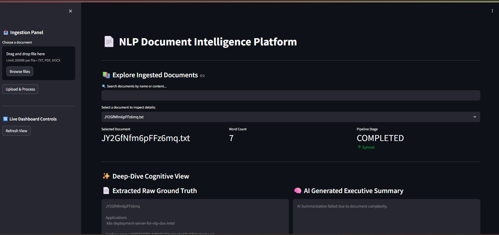
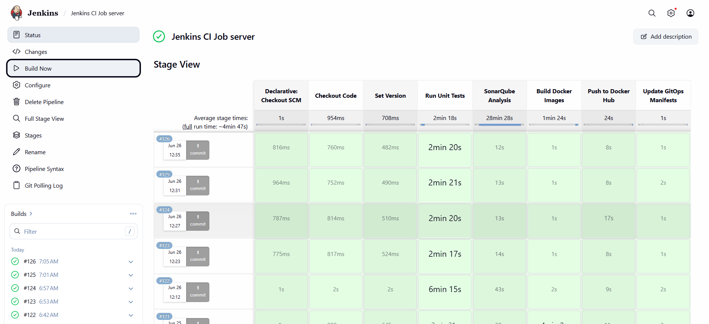
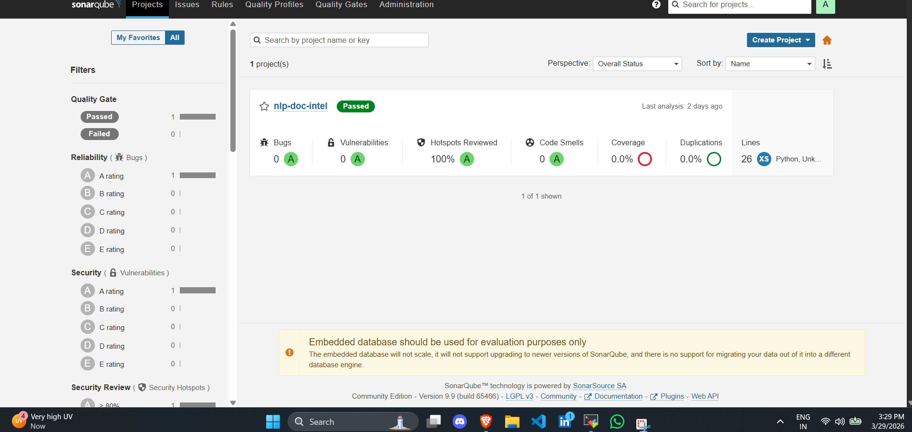
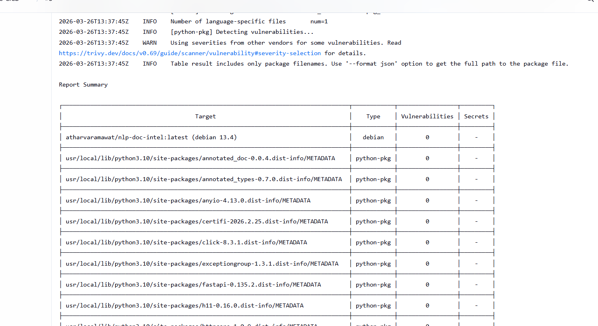
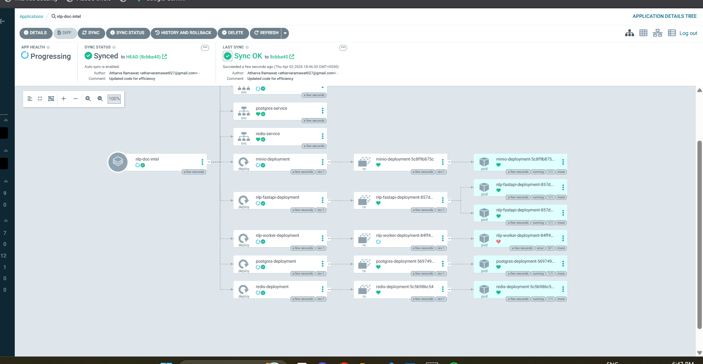
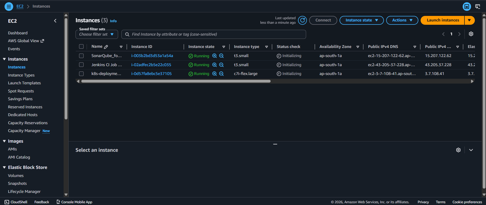
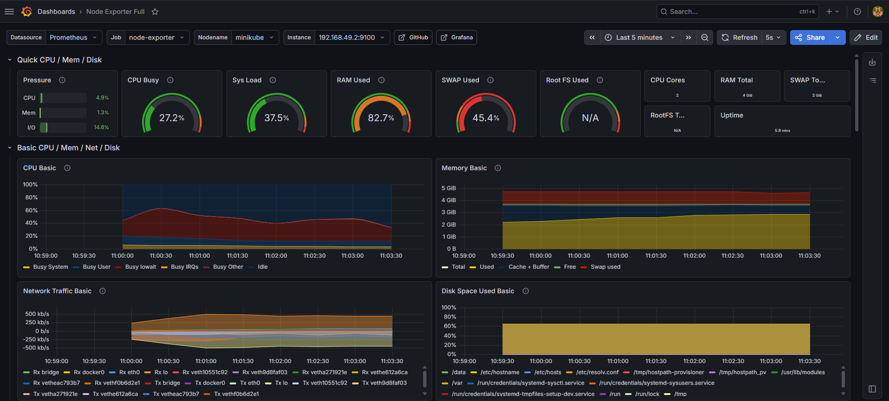

# Production-Grade Document Intelligence Pipeline

This repository contains the infrastructure and deployment configurations for an event-driven Document Intelligence Pipeline. The system is designed to ingest documents, manage them via an asynchronous message queue, perform Natural Language Processing (NLP) summarization and extraction using Hugging Face transformers, and store the results persistently.

The project utilizes a microservices architecture deployed on Kubernetes, managed entirely through a GitOps continuous delivery workflow.

---

## User Interface

The frontend is built with Streamlit, providing a clean, real-time dashboard for users to trigger the distributed pipeline, track execution status, and view the Hugging Face AI cognitive summaries side-by-side with the raw extracted text.



---

## System Architecture

The application is broken down into highly decoupled services to ensure scalability, fault tolerance, and clear separation of concerns.

### Ingestion API (FastAPI)
Acts as the primary entry point. It receives document uploads, validates the data, and orchestrates the initial storage and queuing.

### Object Storage (MinIO)
An S3-compatible storage layer used to securely store the raw uploaded documents (e.g., text, PDF) before processing.

### Message Broker (Redis)
Handles asynchronous task queuing. Once a document is saved to MinIO, a job ticket is pushed to Redis to be consumed by the NLP engine.

### Processing Engine (NLP Worker)
A background service that continuously polls Redis for new jobs, retrieves the corresponding document from MinIO, runs the NLP extraction/summarization logic (`distilbart-cnn`), and outputs the final data.

### Relational Database (PostgreSQL)
Stores the final structured metadata, extracted text, and summaries generated by the NLP worker.

---

## Continuous Integration & Delivery (CI/CD) Workflow

This project enforces a strict **Shift-Left Security and Quality Pipeline**.



### 1. Code Commit & Build (Jenkins)
Developers push application logic to the source code repository. Jenkins triggers a build pipeline, checking out the code and setting the version.

### 2. Quality Gate (SonarQube)
The code undergoes static analysis to enforce coverage and code quality standards, ensuring zero bugs and reviewed security hotspots.



### 3. Security Scan (Trivy)
The container image is built and scanned for critical vulnerabilities before being authorized for the registry.



### 4. GitOps Synchronization (Argo CD)
Upon passing all quality and security gates, the image is pushed to Docker Hub, and Jenkins updates the Kubernetes manifests. Argo CD acts as the GitOps controller, automatically synchronizing the cluster state on AWS EC2 to match the repository.



---

## Infrastructure & Observability

The entire infrastructure runs on AWS EC2 instances, orchestrated by Kubernetes.



The observability stack runs in the `monitoring` namespace. Prometheus is configured to scrape metrics from cluster nodes and application pods, which are visualized via Grafana to track CPU pressure, memory utilization, and disk I/O.



---

## Technology Stack

### Application & Data Layer
| Component | Technology |
|------------|------------|
| Language | Python 3.x |
| Web Framework | FastAPI |
| UI Dashboard | Streamlit |
| NLP Model | Hugging Face (`distilbart-cnn`) |
| Message Queue | Redis |
| Database | PostgreSQL |
| Object Storage | MinIO |

### CI/CD & Security
| Component | Technology |
|------------|------------|
| Continuous Integration | Jenkins |
| Static Code Analysis | SonarQube |
| Vulnerability Scanning | Trivy |
| Containerization | Docker |
| Container Registry | Docker Hub |

### Infrastructure & Orchestration
| Component | Technology |
|------------|------------|
| Container Orchestration | Kubernetes |
| Continuous Delivery (GitOps) | Argo CD |
| Cloud Provider | Amazon Web Services (EC2) |

---

## Local Deployment Instructions

While Argo CD manages the production state, the cluster can be deployed manually for development and testing.

### Prerequisites
- Kubernetes Cluster
- kubectl
- Docker

### Deploy the Application
```bash
kubectl apply -f k8s/
```

### Verify Deployment
```bash
kubectl get pods -n default
```
Ensure all pods transition to the `Running` state.

---

## Repository Structure

```text
.
├── backend/
├── frontend/
├── images/
│   ├── app.png
│   ├── argocd.png
│   ├── aws.png
│   ├── grafana.png
│   ├── jenkins.png
│   ├── sonarqube.png
│   └── trivy.png
├── k8s/
├── Jenkinsfile
└── README.md
```

---

## Maintainer
**Atharva Ramawat**